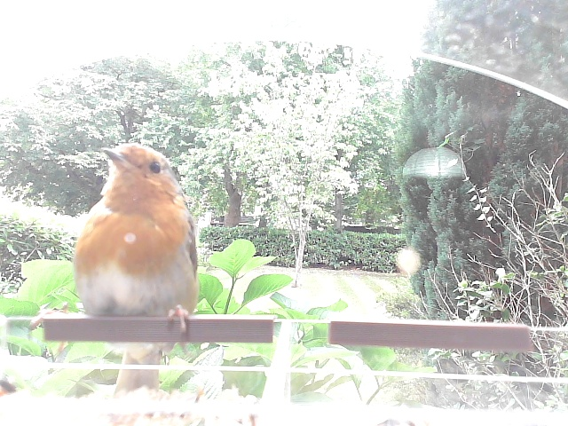
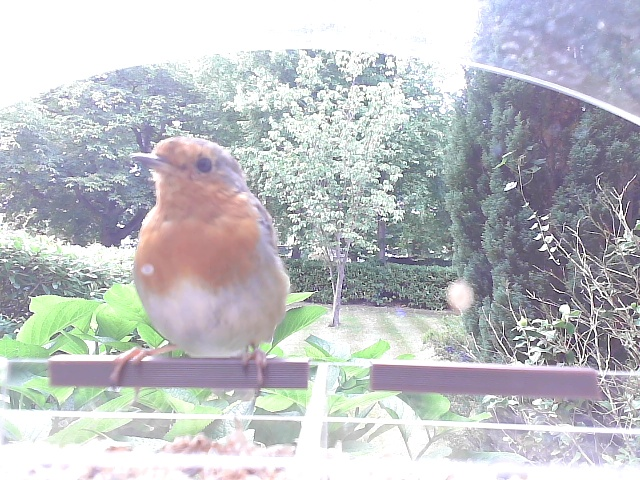

## Goal: figure out if big Robin on bird feeder is really heavier than all the others

## Part 1 - Weigh the birds and their picture

Got this working with a load cell attached to a bird feeder, for detailed instructions on how to do this check out my [blog on the topic](https://hughevans.dev/load-cell-raspberry-pi/). All the code for this step can be found it the `bird_weights` dir.

This part is built around a simple script which spits out photos of birds when they land on the feeder along with their weights to the `images` dir, for example:

*images/bird_20250801_120750_19.5g.jpg*

## Part 2 - Automatically detect species based on photo

This part was much tricker that the first, initially I tried using [this bird species classifier model](https://huggingface.co/chriamue/bird-species-classifier/blob/main/README.md) from HuggingFace but it didn't have the coverage I needed for the kinds of British songbirds who are visiting my bird feeder. I experimented with training my own models using some of the examples on the TensorFlow website (including [this one](https://github.com/tensorflow/docs/blob/master/site/en/tutorials/images/classification.ipynb)) but couldn't get good results. My DIY'ed models always ended up over fit to my data and in the end I couldn't even get a binary classifier working to see if a fox was present in the image.

Luckily I found [this video](https://youtu.be/pFEhSCYy2LA?si=tYME7Nr-nK6w-ieE) by [Jeff's Pi in the Sky](www.youtube.com/@jeffs_piinthesky) about an older bird classifier Jeff used in his own bird recognition project that was initially trained by [SecretBatCave](https://github.com/secretbatcave/Uk-Bird-Classifier). This model still has some problems (the model seems to default to "cat" for images that should probably be categorized as unknown, can't recognize regular visitors to my bird feeder like Great Tits etc) but is pretty good at recognizing Robins so ended up saving this project.

I adapted Jeff's implementation of using the model for inference to label images produced by the script in part 1 and move them to the `identified_images` dir, for example:

*identified_images/robin_20250801_193326_21.1g.jpg*

## Part 3 - Identify individual birds based on weight and photo data

[Zero shot image classification](https://docs.voxel51.com/tutorials/zero_shot_classification.html#Evaluating-Zero-Shot-Image-Classification-Predictions-with-FiftyOne)

## Part 4 - Collect bird data and figure out average weight by species

Final Result